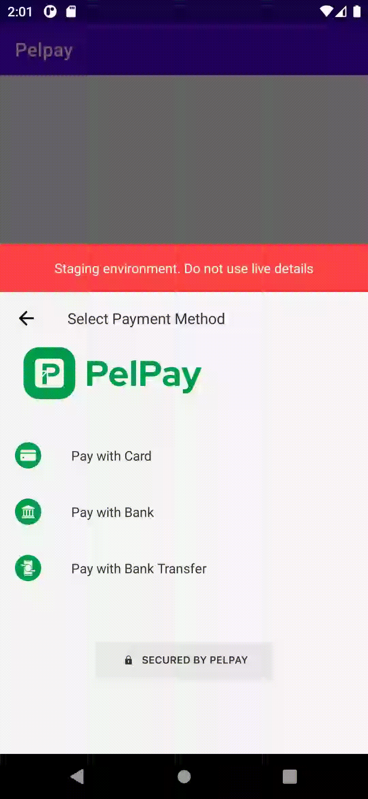

# Pelpay Android SDK
Welcome to Pelpay's Android SDK. This library will help you accept card and alternative payments in your Android app.
**The Pelpay Android SDK permits a deployment target of Android version 21 or higher**.

## Features
- Highly customizable: Change look & feel of the SDK to suit your brand, set your own logo
- Multiple payment methods
- 3D-Secure & many more

| Pay VIA Credit Card | Pay VIA Bank Payment | Pay VIA Bank Transfer |
| ------------- | ------------- | ------------- |
|   |   ||


## Supported Payment Methods
- Credit Card
- Bank Payment
- Bank Transfer
## Installation
[](https://jitpack.io/#David-Eti/pelpay_android)
### Install and Configure the SDK
1. Add it in your root build.gradle at the end of repositories:

```
allprojects {
		repositories {
			...
			maven { url 'https://jitpack.io' }
		}
	}
```
2. Add the dependency
```
dependencies {
	        implementation 'com.github.David-Eti:pelpay_android:1.0.0'
	}
```
### Configure your Pelpay integration
**Step 1**: Configure Client ID, Client Secret & Integration Key
After installation of the Pelpay SDK, configure it with your Client ID, Client Secret & Integration Key gotten from your merchant dashboard, for both test and production

#### Sample Integration (Kotlin)
```kotlin
  PelpaySdk.setTransaction(Transaction(
                amount = 50,
                currency = "NGN",
                merchantRef = "UNIQUE_GENERATED_VALUE",
                narration = "Sample pay from Android",
                splitCode = "",
                integrationKey = "INTEGRATION_KEY_FROM_MERCHANT_DASHBOARD",
                customer = Customer(
                        customerID = "xxx",
                        customerLastName = "olajuwon",
                        customerFirstName = "adeoye",
                        customerEmail = "olajuwon@yopmail.com",
                        customerPhoneNumber = "07039544295",
                        customerAddress = "16 Egbeda Road",
                        customerCity = "Lagos",
                        customerStateCode = "LA",
                        customerPostalCode = "12345",
                        customerCountryCode = "NG"
                )
        )).setBrandPrimaryColor(Color.parseColor("#009F49")).setHidePelpayLogo(false).initialise(environment = Environment.Staging, clientId = "CLIENT_ID_FROM_MERCHANT_DASHBOARD",
                clientSecret = "CLIENT_SECRET_FROM_MERCHANT_DASHBOARD", context = this).withCallBack(callback = object : PelpaySdkCallback() {
            override fun onSuccess(adviceReference: String?) {

                Log.e("PELPAYSDK", "onSuccess: $adviceReference")
            }

            override fun onError(errorMessage: String?) {
                Log.e("PELPAYSDK", "onError: $errorMessage")
            }
        })
```
---

##### Optional (You can add a merchant logo)
To do this, after the `.setHidePelpayLogo(false)` call:

```kotlin
            .setMerchantLogo(drawable)
```
**Note** : Ensure when going live, you change the implementation from Staging `Environment.Staging` to production `Environment.Production`. 
Also ensure you don't use staging credentials on production

**Demo**

Use the `5061 2000 0000 0000 195` test card number to trigger an OTP payment flow with CVV/CVC: `109` future expiration date: `12/2025`, Pin: `1234`

Use the `4456 5300 0000 0007` test card number to trigger a 3D Secure payment flow with CVV/CVC: `444` future expiration date: `12/2025`, Pin: `1234`

Use the *WEMA BANK* with Account number `0238681912` to test bank transactions.

OTP: `123456`


---
